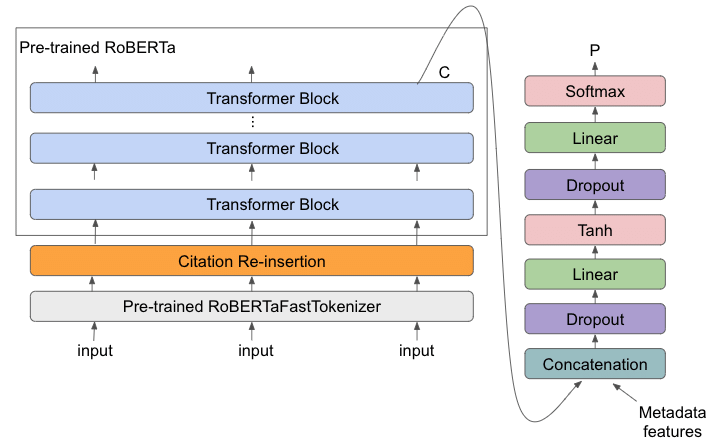

# Image Captioning with contextual embedding
This Repository refers to the Final Project of the course Advanced Machine Learning (AML) at University Sapienza of Rome 2022/2023.

## Group members:
* Alessandro Sottile
* Francesco Sciarra
* Giacomo Scarponi 
* Carolina Romani 

# Abstract

In our project, we presented an image captioning model based on the use of an encoder/decoder architecture. In particular, we used for the encoder a ViT (Vision Transformer) pretrained on ImageNet21k and for the decoder a RoBERTa model pretrained on english raw texts, both fine tuned on Flickr8k dataset. Our model was able to generate reasonable textual descriptions of images only when the subjects of the images were animals, in particular dogs, or humans.

# Introduction
Image captioning combines two tasks that belong to different area of machine learning: natural language processing and computer vision. In practice, image captioning is a task that consists in generating a textual description from an image. This method is useful to increase the accessibility of images for people with visual disabilities and to allow image comprehension systems to better understand the content of images.

# Related work
Dosovitskiy et al (2021) proved that Vision Transformer obtains excellent results compared to Convolutional Neural Networks and require less computational resources for the train. Wang et al (2019) shows that a BERT model could be used as a language generator, despite of the fact that BERT was trained on language modeling and next sentence prediction tasks only.

# Proposed method explained
Image captioning could be seen as a sequence to sequence problem, meaning that we can treat the starting image as a sequence and, from this sequence, we can generate a human readable sentence, which effectively is another sequence. To do so, we decided to adopt an encoder/decoder architecture, which is really suitable to solve seq2seq problems.
The encoder part of our architecture is a Vison Transformer, which is proved to be superior to the convolutional neural network when it comes to many computer vision tasks such as image detection or image classification. Basically vision transformer project the 2d image to a one dimensional space, dividing the original image in different patches of the same size. These patches are the treated as it were a normal sequence from a base transformer encoder. The advantage of splitting the original image into patches is that we loose part of the inductive bias that we had on convolutional neural network, because we are now considering the image as a sequence and not as a 2D structure. We adopted a pre-trained ViT on the imagenet21k dataset, which is a large collection of 14 millions images divided in 21841 classes. 

The pretrained ViT is intended to be used for a classification task, so we did minor changes to the model to make it suitable to our task. In addition to that, during the training phase we frozen the first 5 out of 12 layers to avoid the loss of high level feature learned from the pre-training of the model. Doing so, the encoder is able to encode the image into a sequence that is usable to the decoder part.
The decoder is pretrained RoBERTa model, which basically is a BERT model but trained on more data with larger batch size, with dynamic masking instead of static masking and it was trained only on the language modeling task.
Both models are trained with the Adam optimization algorithm with L2 regularization, which is a technique that helps the model to avoid overfitting. In addition to that we also added a very low dropout rate to the self attention and feedforward layers that helps prevent overfitting aswell.
The RoBERTa decoder is trained on the dataset captions in order to get all the relevant words that could describe the images in the best way possible.

# Dataset and Benchmark

In this project, we used the Flickr8K dataset, which is available for free and consists of 8,000 images, each of which is paired with five different captions that provide a clear description. Given its small size, compared to other datasets, Flickr8K allows the model to be trained despite the average performing hardware. We splitted our dataset in:
●	5664 examples for train
●	1213 for validation
●	The others for test

# Experimental results
During the training we can see a slow decrease of the loss on the training set, while in the validation, around the tenth epoch, the loss begins to increase slowly. This is a usual behavior when the model is overfitting. To avoid this we tried to change different hyperparameters such as learning rate, weight decay and the batch size within the limits of our hardware. Unfortunately none of these approaches solved the issue. One way to overcome this problem could be to work with a larger dataset, since it is proved that in general having more data helps the model to better generalize. Moreover our architecture is transformer based and for this reason having more data could be even more helpful.

#### dropout: 0.5  learning rate: 0.0005

#### dropout: 0.5  learning rate: 0.0003

#### Correct captioning

#### Incorrect captioning

# Conclusions and future work
Image captioning can be consider as a non trivial task given the fact that it lies in the intersection between two different fields that are computer vision that addresses images, and natural language processing that addresses words. Effectively our model is performing poorly as already shown in the previous paragraph. We believe that training the model on a larger dataset, could help the model to better generalize and consequently to increase performances on this task. Another major change could be to use a Swin Transformer as backbone for the model, since it is proved that Swin Transformer outperforms Vision Transformer in many tasks such as object detection and semantic segmentation.

# References
* [Image_Captioning_using_Hugging_Face (https://github.com/kalpesh22-21/Image_Captioning_using_Hugging_Face)]
* Dosovitskiy et al, “An Image is Worth 16x16 Words: Transformers for Image Recognition at Scale” (2020)
* Wang et al, “BERT has a Mouth, and It Must Speak: BERT as a Markov Random Field Language Model” (2019)
* Xu et al, “Show, Attend and Tell: Neural Image Caption Generation with Visual Attention”, ICML (2015)

